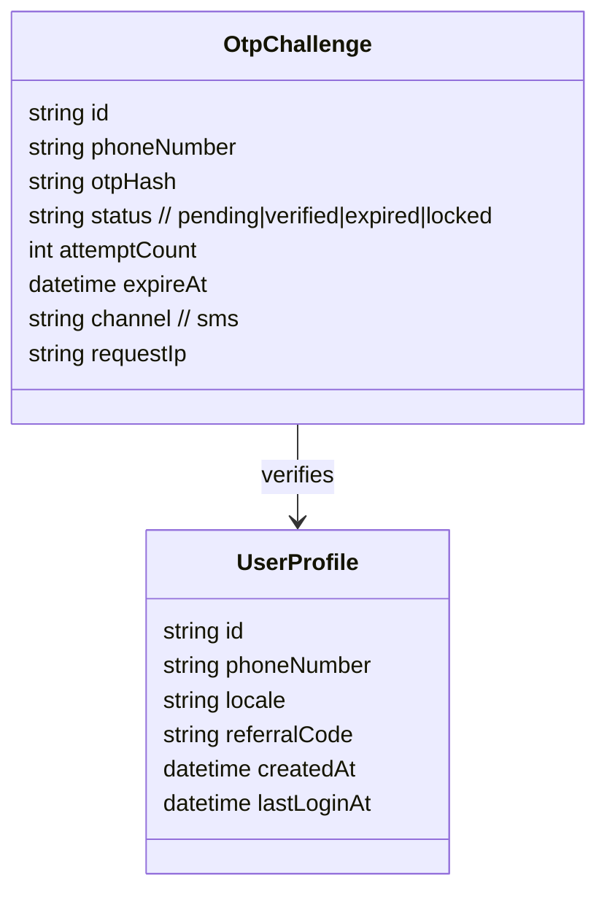

# 認證與註冊服務設計（手機號碼 + SMS OTP）

## 流程概觀
1. 使用者輸入手機號碼發送註冊請求。
2. 系統產生一次性驗證碼（OTP），透過簡訊供應商 API 發送。
3. 使用者於 App 輸入收到的驗證碼。
4. 後端驗證 OTP 後建立使用者帳號、發送存取權杖，完成註冊與登入。

## 系統組件
- **Auth API Gateway**：對外暴露 `/auth` 相關 REST/GraphQL 端點，負責節流與速率限制。
- **OTP Service**：負責產生、儲存、驗證 OTP，並觸發簡訊供應商 API。
- **User Service**：管理使用者主檔、裝置綁定、推播 token 與車輛資料。
- **SMS Provider Adapter**：對接 Twilio、MessageBird 或台灣在地簡訊業者的 SDK/API。
- **Event Bus (Kafka/PubSub)**：發送 OTP 驗證成功、失敗事件，供風險偵測與 CRM 系統使用。

## API 端點
| Method | Endpoint | 說明 |
| --- | --- | --- |
| `POST` | `/auth/otp/request` | 驗證手機號碼格式、觸發 OTP 發送、回傳節流資訊。|
| `POST` | `/auth/otp/verify` | 驗證 OTP，建立或回傳既有使用者帳號，回傳 JWT/OAuth token。|
| `POST` | `/auth/otp/resend` | 於節流限制內重新發送 OTP。|
| `POST` | `/auth/logout` | 作廢 refresh token 與裝置 session。|

詳細欄位定義請參考 [OpenAPI 規格](api/authentication.yaml)。

## OTP 生命週期管理
- OTP 長度 6 碼，使用加鹽 HMAC 或一次性隨機碼。
- 有效期限預設 5 分鐘，超時需重新申請。
- 每個號碼 5 分鐘內最多允許 3 次請求，超過進入冷卻期。
- 驗證錯誤超過 5 次鎖定 15 分鐘並通報風險系統。
- 使用 Redis 或 DynamoDB TTL 儲存 OTP 狀態（`pending`、`verified`、`expired`）。

## 資料模型

## 安全性考量
- 對外僅允許台灣號碼格式（`+8869xxxxxxxx` 等）並移除特殊字元。
- 對 OTP 輸入進行速率限制與 CAPTCHA（多次失敗後觸發）。
- 簡訊內容避免包含敏感字，並加入品牌識別避免網路釣魚。
- 建立 audit log，記錄 OTP 發送與驗證狀態，符合個資法與 GDPR。
- 使用專用 VPC 與 allowlist IP 與簡訊供應商溝通。

## 監控與告警
- 指標：OTP 發送成功率、平均到達時間、驗證成功率、失敗原因（逾期/錯誤碼/黑名單）。
- 告警規則：
  - 發送成功率 < 95% 連續 5 分鐘。
  - 验證錯誤率 > 10% 連續 10 分鐘。
  - 單號碼請求量高於基線 3 倍（疑似攻擊）。
- 使用 Grafana 建立儀表板，與 PagerDuty/OPS Genie 連動值班通知。

## Runbook（故障排除步驟）
1. **發送成功率驟降**：
   - 檢查簡訊供應商狀態頁與 API 回應碼。
   - 切換至備援供應商或備援發送路由。
   - 通知客服暫停大規模促銷簡訊，避免雪崩。
2. **驗證成功率下降**：
   - 檢視 Redis 中 OTP 存取狀態是否逾期或未寫入。
   - 確認時間同步（NTP）與 TTL 設定。
   - 透過日誌追蹤特定號碼是否被鎖定或遭冒用。
3. **濫用攻擊（大量請求）**：
   - 啟用 WAF/Cloudflare 黑名單，封鎖異常 IP。
   - 將超量號碼加入臨時黑名單並通知風控。
   - 啟動 CAPTCHA 或改為語音 OTP 備援。

## 延伸功能
- 企業/車隊帳號支援：同號碼多裝置授權管理。
- 與 CRM 同步，完成註冊後推送歡迎優惠券。
- 建立風險評分模型，對高風險號碼要求額外 KYC。
- 支援 LINE Login / Apple Sign-In 與手機號碼綁定。
